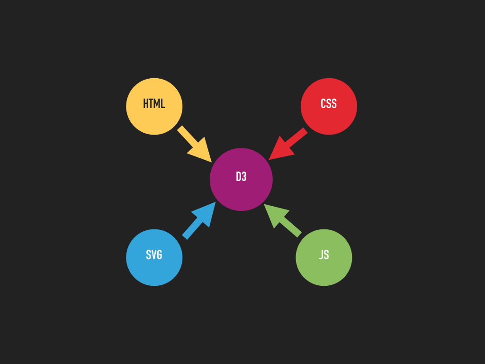
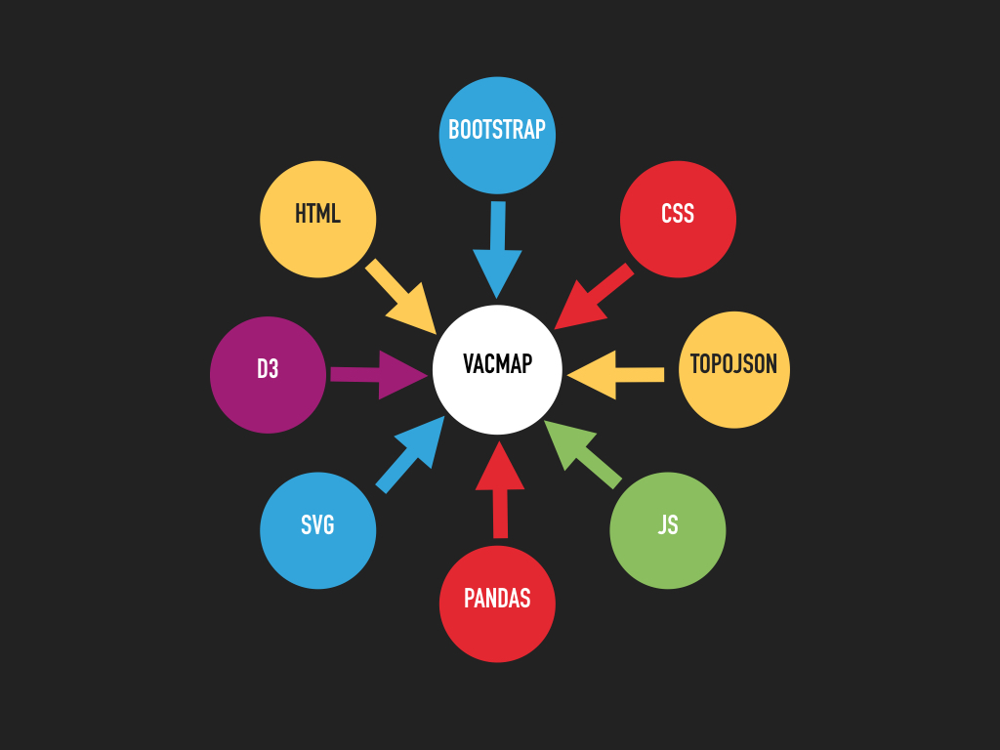
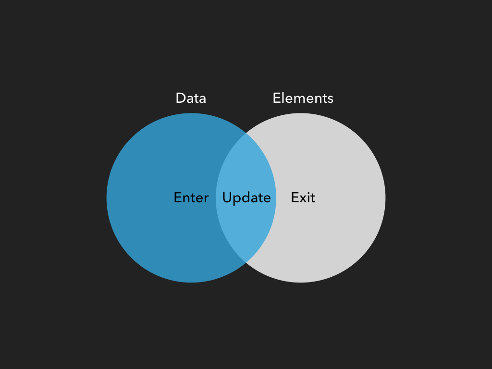

## Keynotes D3

* selections
* data joins and key functions
* update, enter, exit
* method chaining
* event handlers and listeners
* filter, each
* transitions

## Slides and Code

* [Slides](https://github.com/AliceWi/IntroToD3/tree/gh-pages/presentation)
* [Example 0](https://github.com/AliceWi/IntroToD3/tree/gh-pages/jsintro) Javascript Basics
* [Example 1](https://github.com/AliceWi/IntroToD3/tree/gh-pages/fancyRectangles) Fancy Rectangles
* [Example 2](https://github.com/AliceWi/IntroToD3/tree/gh-pages/d3Pattern) Update, Enter, Exit
* [Example 3](https://github.com/AliceWi/IntroToD3/tree/gh-pages/d3Pattern) Update, Enter, Exit + Key Function
* [Example 4](https://github.com/AliceWi/IntroToD3/tree/gh-pages/movingCircles) Moving Circles (by Dirk Brockmann)
* [Example 5](https://github.com/AliceWi/IntroToD3/tree/gh-pages/simpleVacMap) Simple VacMap

## Tutorials

* [Let's Make a Bar Chart](https://bost.ocks.org/mike/bar/)
* [How Selections Work](https://bost.ocks.org/mike/selection/)
* [Let's Make a Map](https://bost.ocks.org/mike/map/)
* [How To Infer Topology](https://bost.ocks.org/mike/topology/)
* [Command-Line Cartography](https://medium.com/@mbostock/command-line-cartography-part-1-897aa8f8ca2c)
* [Bootstrap](https://www.w3schools.com/bootstrap/)

## Video tutorials

* [Curran](https://www.youtube.com/watch?v=8jvoTV54nXw)

## Usefull links

* [Homepage Dirk Brockmann](http://rocs.hu-berlin.de/) has cool D3 examples
* [D3 Homepage](www.d3js.org)
* [D3 API](https://github.com/d3/d3/blob/master/API.md)
* [TopoJSON](https://github.com/topojson/topojson)
* [get Bootstrap](getbootstrap.com/)
* [MapShaper](mapshaper.org/)
* [JSbin](https://jsbin.com/)
* [Sublime Text 3](https://www.sublimetext.com/)

## Further reading

* [D3 Paper](vis.stanford.edu/papers/d3)
* [D3.express](https://medium.com/@mbostock/a-better-way-to-code-2b1d2876a3a0)

## Important Slides

By Alice Wittig June 2017
